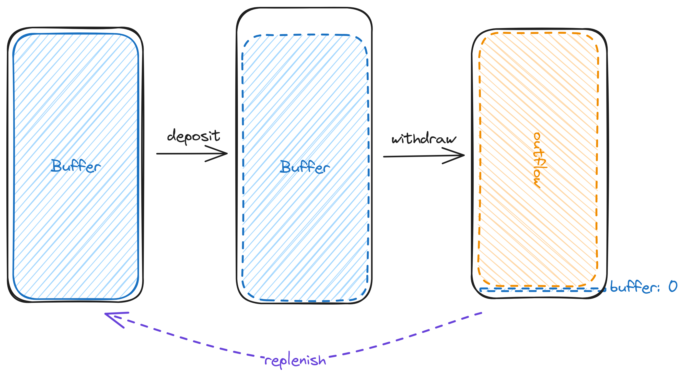

# Decrease Limiter

## Goal

The goal of decrease limiters is to detect large spikes in short-term **decreases of a set metric**
in a smart contract system. This decrease limiter is primarly aimed at tracking and limiting sudden
changes in asset reserves.

Specifically this allows it to serve as a general purpose security mechanism by limiting the core
damage (loss of assets) a smart contract application may suffer irrespective of the root cause as
it only concerns itself with inflows and outflows.

Applying this limiter can allow funds to flow freely in and out of protocols while providing
protection in the case of an exploit by the capping the losses at the configured short-term max
change.

## Design

### Outflow tracking

The overarching mechainsm to implement is a system that signals whenever the net outflows $\Delta x$
over a given a time frame (main time frame) $T_m$ exceeds some % threshhold $r$ of the total reserves
$x$. Limiting cumulative outflows rather than tracking & limiting liquidity events is important for
resistance against sybil attacks whereby an attacker dodges a limiter by splitting their large total
outflow over several small withdrawals.

#### Naive Approach

Naively this can be achieved by tracking all flows (in/out) along with their timestamp, filtering by
$t_i \ge t - T_m$, summing them (the outflows) up and comparing them against the threshold $x\cdot r$ (whereby $x$
is the total reserves $T_m$ seconds ago).

This approach is precise but not very efficient due to every liquidity event having to be
individually tracked and retrieved, leading up to $O(n)$ storage reads to compute the signal and $O(1)$ writes which are particularly expensive in the EVM.

#### The _Buffer_ Based Design

Instead of tracking individual liquidity events this design tracks the cumulative remaining outflow
capacity, dubbed the "main buffer" $b_m$. This buffer is depleted whenever an outflow occurs and is
replenished gradually over time up to its cap which is defined as the threshold $x \cdot r$:

$$ b_m' := \min (x\cdot r, b_m + x\cdot r \cdot \frac{\Delta t}{T_m}) - \Delta x$$

A negative post-update buffer ($b' \lt 0$) indicates that the limiter has been exceeded. In the
core implementation the buffer is represented as an unsigned integer, meaning its lower bound is
`0`. To indicate that a given limiter has been exceeded the update method returns an `overflow`
value indicating how much of the change went beyond the limit:

```solidity
function applyOutflow(
    DecreaseLimiter limiter,
    LimiterConfig config,
    uint256 preTvl,
    uint256 outflow,
    uint256 currentTime
) internal pure returns (DecreaseLimiter updatedLimiter, uint256 overflow) {
    // ... actual logic
}
```

**Illustrated as:**


**How the Main Buffer Handles Inflows**

The only impact inflows have to the main buffer is to increase the its cap and replenish rate.


### Mitigating Denial-of-Service (DoS): The _Elastic_ Buffer

If the rate limiter were only made up of the main buffer and used to track asset inflows/outflows it
would be trivial to have it continuously be maxed out ($b_m = 0$) via a simple flashloan:



To mitigate this any useful on-chain rate limiter must account for short-term inflows, not only
outflows. Our decrease limiter does this via the _elastic_ buffer. Similar to the main buffer it
tracks the cumulative total of short-term allowed outflows ($b_l$). Together the elastic + main buffer
represent the total capacity i.e. max. short-term outflow ($b = b_m + b_l$).

Upon inflows the elastic buffer is temporarily increased:


To ensure that the total outflow capacity ($b_m + b_l$) eventually returns to base line
(the intended max capacity $x \cdot r$) the elastic buffer decays proportionally to time:

$$b_l' := \max (0, b_l \cdot (1 - \frac{\Delta t}{T_l}))$$

The elastic buffer is decayed proportionally to time rather than at a fixed rate to ensure that
regardless of its size it resets after a certain amount of time (approaches zero to be precise).
Note that the window over which the main buffer replenishes ($T_m$) can be different than the period
over which the elastic buffer decays ($T_l$).

> [!IMPORTANT]
> Elastic buffer updates are not additive. Meaning updating it twice, once after $\Delta t_1$ and
> $\Delta t_2$ will yield a different result than updating it once after $\Delta t_1 + \Delta t_2$.
> The more frequent the updates the slower the decay, with the worst case being $\large e^{\frac{\Delta t}{T_l}}$

## Implementation

While correctness is the primary goal of this library the implementation of decrease limiters has
been made with performance considerations in mind. Specifically regarding the limiter's data
footprint as accessing storage (reading, writing) is notoriously some of the most expensive 
operations that are done in the EVM.

### Buffer Representation

To ensure that all the data required to represent the changing state of a decrease limiter (last
update timestamp, main buffer, elastic buffer) fits in minimal space while supporting assets with
variable denominations and total supplies the value of the buffer's _relative_ to the contract's
total reserves is tracked:

$$repr_{main}(b_m) = \frac{b_m}{x \cdot r} \in [0; 1]$$

$$repr_{elastic}(b_l) = \frac{b_l}{x} \in [0; 1]$$

In turn fractional numbers are represented using the commonly adopted "WAD" fixed-point number
representation:

$$repr_{num}(x) = \lfloor x\cdot 10^{18} \rfloor$$

Combined this allows us to know that both buffers will always each fit in a 64-bit value:

$$ max\_buffer\_repr = 1 \cdot 10^{18} $$

$$ max\_buffer\_bits = \log_2 (1 \cdot 10^{18}) \approx 59.79\ bits $$


### Timestamps

For state to be updated correctly regardless of update frequency each limiter must keep track of the
last time at which it was updated so it can effectively calculate the time passed $\Delta t$. Time
is tracked in seconds and stored as UNIX time (seconds since the 1st January 1970). A 32-bit value
is allocated for timestamps. This means that the timestamp of rate limiters will only overflow in
the year 2106.


**Purposeful Truncation**

Systematic truncation of the time passed ($\Delta t$) to 32-bits ensures that the rate limiter can
theoretically continue functioning correctly well past 2106, as long as the rate limiter is updated
once every <136 years. This is because truncating to 32-bits is effectively like applying modulo 
$2^{32}$ to operations.

Under modular arithmetic the two expressions are equivalent as long as $a - b \le m$:

$(a - b) \mod m = (a - (b \mod m)) \mod m$

### Packing

All together, the last updated timestamp, main buffer and elastic buffer representation are packed
into 1 EVM word (256-bits, represented in 2-byte chunks):


## Known Issues & Open Questions

> [!WARNING]
> No formal audit has yet been conducted on this codebase, the severity of some the issues may be
> understated

### Non-additivity of elastic buffer updates

As previously mentioned updating the elastic buffer two times after $t_1$ and $t_2$ seconds leads to
a different value than if it were updated once after $t_1 + t_2$ (assuming none of the two values
are $0$). This could allow someone to slow the decay of the elastic buffer to its worse case
$e^{\frac{\Delta t}{T_l}}$:

$$b_l \cdot (1 - \frac{t_1}{T_l}) \cdot (1 - \frac{t_2}{T_l}) \ne b_l \cdot (1 - \frac{t_1 + t_2} {T_l})$$

This seems to be a medium-low severity issue as even in the worst case the elastic buffer would
still decay. At most this would give an attacker some added optionality of when to steal
funds. Yearn's base vault contract has similar behavior for the _decay_ (dubbed "degradation" in
their contract) of temporarily locked profits.[^1]

### New, legitimate inflows temporarily at risk

Due to having to account for new inflows by adding them to the elastic buffer this makes new inflows
essentially temporarily excluded from the "max loss cap" e.g.:

A decrease limiter is configured with a 5% max main buffer ($r = 0.05$) and starts out by holding
$ 10M worth of assets (ignoring main buffer replenishment for the sake of simplicity)

|Action|      TVL| Main Buffer|Elastic Buffer|Max short-term loss|
|------|--------:|-----------:|-------------:|------------------:|
|Start |    $ 10M |     $ 0.5M |      $ 0.0  |      (5%) $ 0.5M  |
|$ 1.2M deposit| $ 11.2M| $ 0.5M |      $ 1.2M |    (**15.2%** 😬) $ 1.7M |
|$\frac{T_l}{2}$ passes| $ 11.2M| $ 0.5M |      $ 0.6M |     (9.8% 😅) $ 1.1M |
|Another $T_l$ passes| $ 11.2M| $ 0.5M |      $ 0.0M |      (5% 👍️) $ M |

This is admittedly a pretty severe flaw but arguably an unavoidable trade-off. The more sensitive
you make a limiter to short-term inflows the easier and more severe you can DoS it, the less
sensitive you make it the more new inflows are at risk. An attacker who discovers a flaw in
a decrease limited contract may wait for a large inflow before exploiting the vulnerability to
maximize the amount they're able to steal.

This issue can be mitigated in the frontend of DeFi applications and through user education by
advising larger "whales" to be careful with new deposits and always enter contracts in smaller
chunks. Additionally one could also limit the amount of short-term inflows. Alternative mechanisms
such as streamed deposits, designated deposit queues or whitelists could be used to improve the UX
for users looking to deposit large sums over short time frames.

### Unaccounted inflows immediately increase buffers

Due to the relative internal representation of buffers an unaccounted inflow such as a direct ERC20
transfer or self destruct (for ETH) would increase the buffer's and therefore their withdraw
capacity (where $r_m$ and $r_l$ are the fractional representation of the main and elastic buffers
respectively):

$$\Delta b = r_m \cdot r \cdot \Delta x + r_l \cdot \Delta x$$

However such an inflow cannot result in a net-increase of the outflow capacity:

$$\Delta x \lt \Delta b$$
$$ \Delta x \lt r_m \cdot r \cdot \Delta x + r_l \cdot \Delta x \gt \Delta x$$
$$ 1 \lt r_m \cdot r \cdot + r_l $$

Proof by induction that $1 \lt r_m \cdot r \cdot + r_l$ is always false:
- start state of $(r_m, r_l)$ is $(1, 0)$ (main buffer full capacity, elastic buffer empty)
- outflows strictly decrease the buffer representations (proof of this assumption left to the reader)
- inflow cannot change $1 \ge r_m \cdot r \cdot + r_l$ to $1 \lt r_m \cdot r \cdot + r_l$:

$$1 \lt r_m' \cdot r + r_l' $$

$$1 \lt \frac{b_m}{x' \cdot r} \cdot r + \frac{b_l'}{x'} $$

$$1 \lt \frac{r_m \cdot x \cdot r}{(x + \Delta x) \cdot r} \cdot r + \frac{x \cdot r_l + \Delta x}{x + \Delta x} $$

$$1 \lt \frac{r_m \cdot x }{x + \Delta x} \cdot r + \frac{x \cdot r_l + \Delta x}{x + \Delta x} $$

$$x + \Delta x \lt r_m \cdot x  \cdot r + x \cdot r_l + \Delta x $$

$$x \lt r_m \cdot x  \cdot r + x \cdot r_l $$

$$1 \lt r_m \cdot r + r_l $$

For $r_m \cdot r + r_l$ to be greater than $1$ post inflow it must be already be so prior to the
inflow, this state is therefore unreachable.

Considering no net withdraw capacity increase is possible this seems like a minor issue as an
attacker would have to send in more assets than they could withdraw.

### Parameter Choice

Generally these are relative subjective reasons to assign these parameters, more research is
required.

**Max Draw Down ($r$)**

The max withdraw capacity ($r$) is somewhat subjective and up to a team's risk tolerances.
Generally a low number such as 2-5% seems sensible as for a reasonably large protocol this limit
should rarely have to be hit, furthermore it's well below the customary "10% of stolen TVL" bounty 
that is often granted to successful attackers. 

**Main buffer replenish time frame ($T_m$)**

This parameter should likely depend on how fast the protocol team / their monitoring infra is to
respond to alerts. Large teams with a well set up monitoring and incidence response plan can likely
go as low as 2-3h. Going much lower is risky as it may make protocols vulnerable to block stuffing
attacks whereby an attacker buys out all block space for a longer time frame to wait out the
replenish and block any pausing/upgrading transactions.

**Elastic-to-Main buffer time frame ratio ($\frac{T_l}{T_m}$)**

This is the biggest ??? at the moment. The lower the ratio the faster new deposits are protected but
the easier the protocol is to DoS by just depositing, waiting for the elastic buffer to decay and
withdraw.

### 🚧 Others

(Pending more detailed descriptions)

- Still potentially subject to DoS, attacker can just deposit very large amount, wait out elastic
  decay once and repeatedly withdraw up to limit

[^1]: Yearn vault locked profit decay: https://github.com/yearn/yearn-vaults/blob/97ca1b2e4fcf20f4be0ff456dabd020bfeb6697b/contracts/Vault.vy#L829-L847
